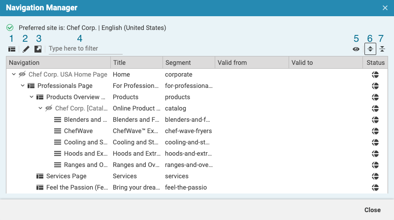

# Navigation Manager

This Studio Client extension allows the editor to easily view and manage the navigation of the preferred site.



## Additional controls

Just above the table of navigation elements there are several controls that provide additional functionality:
1. Create page from template as the child of selected
2. Open selected item in a new Tab
3. Show selected item in Library
4. String filter for text field
5. Show/Hide hidden navigation Items
6. Expand all
7. Collapse all

## Installation

- Find out the version of the workspace in the format 0000.0 - this will be the branch name for the extension.
- From the project root folder, clone this repository as a submodule of the extensions folder. 
```
git submodule add -b <VERSION> https://github.com/coremedia-contributions/navigation-manager.git  modules/extensions/navigation-manager 
```

- Use the extension tool in the project root folder to link the modules to your workspace.
 ```
mvn -f workspace-configuration/extensions com.coremedia.maven:extensions-maven-plugin:LATEST:sync -Denable=navigation-manager
```
